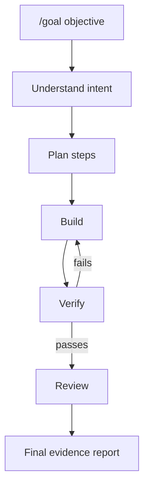

<p align="center">
  
</p>

<p align="center">
  <a href="https://deepwiki.com/ChindanaiNaKub/generalPippy">
    
  </a>
</p>

# GeneralPippy v3.3.0

**GeneralPippy turns OpenCode into a self-driving goal agent.**

Run one command:

```text
/goal "add error handling to the API layer"
```

Pippy plans the work, routes it to the right agent, verifies each step, retries failures, reviews the result, and reports final evidence.

## How It Works



Internally, Pippy runs the full loop: recall, understand, explore, plan, execute, verify, retry, review, final verification, report.

## Why Pippy

Goal-state plugins keep an OpenCode objective active with state, idle continuation, compaction context, and completion markers.

Pippy is the harness around the work: agents, commands, role routing, verification gates, retries, review, budget guidance, and final evidence reports.

They can complement each other. A goal-state plugin keeps the session moving; Pippy teaches OpenCode how to finish the work well.

## What You Get

- `/goal` for self-driving, verifiable work
- `/grill-to-goal` for turning unclear ideas into goal-ready prompts
- `/ship` for review, verification, push, and green-gate PR creation
- `/budget` for OpenCode-recorded role usage accounting and budget guidance
- Role routing across `pippy`, `pippy-plan`, and `pippy-build`
- Verification gates, retry behavior, review, and final evidence reports
- Budget-first defaults with Thorough and Custom profile options
- OpenCode defaults: built-in formatters plus LSP servers. Built-in language servers are enabled by default.
- Guardrail plugin: [cc-safety-net](https://github.com/kenryu42/cc-safety-net) is pinned by the installer
- Installer backups, plugin merging, rollback behavior, and consent-based update checks

## Install

```bash
curl -fsSL https://raw.githubusercontent.com/ChindanaiNaKub/generalPippy/main/install.sh | bash
```

The installer is interactive by default. It lets you choose Budget, Thorough, or Custom model profiles. Custom model IDs must be non-empty; GeneralPippy passes them through to OpenCode without provider verification.

For unattended installs:

```bash
curl -fsSL https://raw.githubusercontent.com/ChindanaiNaKub/generalPippy/main/install.sh | bash -s -- --yes --profile budget
```

Use `install.sh` instead of manually copying files. It handles backups, rollback, plugin merging, profile metadata, and the local update-check helper.

## Basic Usage

```text
/goal "fix the failing tests and verify the suite passes"
```

Use `/goal` when success can be proven with observable evidence such as tests, command output, changed files, or checked docs.

```text
/grill-to-goal "make onboarding nicer"
```

Use `/grill-to-goal` when the idea still needs intent, constraints, non-goals, trade-offs, or acceptance criteria.

```text
/ship
```

Use `/ship` when the branch is ready for review, verification, push, and PR creation after green gates pass.

```text
/budget
```

Use `/budget` to inspect OpenCode-recorded role usage and routing efficiency after real runs.

Use `/pippy-update` to check for GeneralPippy updates manually. To disable startup update checks, set `GENERALPIPPY_UPDATE_CHECK=0`.

## Pippy Loop Stack

GeneralPippy stays config-only. It does not add a long-running runtime service, scheduler, telemetry store, or automatic self-modifying prompt loop.

The useful loops are stacked in the harness:

- **Cross-run memory**: optional, human-approved lessons from prior goal reports
- **Self-driving loop**: `/goal` plans, builds, verifies, retries, reviews, and reports
- **Verification feedback**: acceptance criteria and evidence keep each run grounded
- **External triggers**: cron or CI can invoke `/goal` while scheduling stays outside Pippy
- **Improvement loop**: humans review run reports and improve prompts, docs, tests, or guardrails

## Details

- [Pippy Harness](docs/agents/pippy-harness.md): what maintainers tune
- [Model Profiles](docs/agents/model-profiles.md): Budget, Thorough, and Custom routing
- [Pippy Improvement Loop](docs/agents/pippy-improvement-loop.md): how run evidence becomes reviewed improvements
- [Goal Run Evals](docs/agents/goal-run-evals.md): repeatable checks for Pippy behavior
- [Manual Smoke Tests](docs/agents/manual-smoke-tests.md): installed behavior checklist
- [External Trigger Recipe](docs/agents/external-trigger-recipe.md): recurring `/goal` examples
- [Cross-Run Memory](docs/agents/cross-run-memory.md): human-approved memory boundary
- [ADR-0001](docs/adr/0001-pippy-goal-self-driving-agent.md): original self-driving agent decision

## Local Development

```bash
git clone https://github.com/ChindanaiNaKub/generalPippy.git
cd generalPippy
./install.sh
```

Useful checks:

```bash
bash tests/validate.sh
bash scripts/doctor.sh
scripts/goal-run-smoke-evals.sh --dry-run
scripts/goal-run-smoke-evals.sh --live
```

## License

MIT
